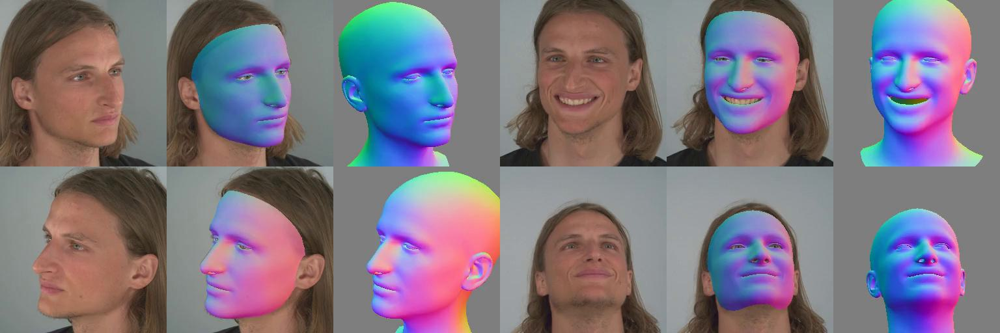

#  Pixel3DMM: Versatile Screen-Space Priors for Single-Image 3D Face Reconstruction
[**Paper**](https://arxiv.org/abs/2505.00615) | [**Video**](https://www.youtube.com/watch?v=BwxwEXJwUDc) | [**Project Page**](https://simongiebenhain.github.io/pixel3dmm/) <br>

<div style="text-align: center">

</div>

This repository contains the official implementation of the paper:

### Pixel3DMM: Versatile Screen-Space Priors for Single-Image 3D Face Reconstruction
[Simon Giebenhain](https://simongiebenhain.github.io/), 
[Tobias Kirschstein](https://niessnerlab.org/members/tobias_kirschstein/profile.html), 
[Martin Rünz](https://www.martinruenz.de/), 
[Lourdes Agaptio](https://scholar.google.com/citations?user=IRMX4-4AAAAJ&hl=en) and 
[Matthias Nießner](https://niessnerlab.org/members/matthias_niessner/profile.html)  


## 1. Installation 

First we need to set up a conda enviroment. Below, there are two installation options presented:

### Option A: Using `environment.yml`
> Note that this can take quite a while.
```
conda env create --file environment.yml
conda activate p3dmm 
```

### Option B: Manual Installation

```
conda create -n p3dmm python=3.9
conda activate p3dmm

pip install torch torchvision torchaudio --index-url https://download.pytorch.org/whl/cu118
conda install nvidia/label/cuda-11.8.0::cuda-nvcc nvidia/label/cuda-11.8.0::cuda-cccl nvidia/label/cuda-11.8.0::cuda-cudart nvidia/label/cuda-11.8.0::cuda-cudart-dev nvidia/label/cuda-11.8.0::libcusparse nvidia/label/cuda-11.8.0::libcusparse-dev nvidia/label/cuda-11.8.0::libcublas nvidia/label/cuda-11.8.0::libcublas-dev nvidia/label/cuda-11.8.0::libcurand nvidia/label/cuda-11.8.0::libcurand-dev nvidia/label/cuda-11.8.0::libcusolver nvidia/label/cuda-11.8.0::libcusolver-dev
```

```
conda env config vars set TORCH_CUDA_ARCH_LIST="7.5 8.0 8.6+PTX"
conda deactivate 
conda activate p3dmm
```


```
pip install git+https://github.com/facebookresearch/pytorch3d.git@stable
pip install git+https://github.com/NVlabs/nvdiffrast.git

pip install -r requirements.txt
```

### 1.1. Final Installation Steps

Finally, you will need to run
```
pip instal -e .
```
to install `pixel3dmm` as a package.

As we use the FLAME 3DMM for tracking, you will need an account for the [FLAME website](https://flame.is.tue.mpg.de/).

Next, you can install all necessary preprocessing repositories and download network weights, by running
```
./install_preprocessing_pipeline.sh
```
#### Downloading FLAME
We added support for `FLAME2023_no_jaw`. It will now be downloaded by default in the previous step. If you have previsouly installed pixel3dmm, you can download FLAME2023 by running
```
./download_flame2023.sh
```
Alternatively, you can manually download both FLAME2020 and FLAME2023 from the [FLAME website](https://flame.is.tue.mpg.de/), unzip, and place the folders `FLAME2020` and `FLAME2023` into `src/pixel3dmm/preprocessing/MICA/data/`


### 1.2 Environment Paths

All paths to data / models / infernce are defined by environment variables.
For this we recommend to create a file in your home directory in `~/.config/pixel3dmm/.env` with the following content:
```
PIXEL3DMM_CODE_BASE="{/PATH/TO/THIS/REPOSITORY/}"
PIXEL3DMM_PREPROCESSED_DATA="{/WHERE/TO/STORE/PREPROCESSING/RESULTS/}"
PIXEL3DMM_TRACKING_OUTPUT="{/WHERE/TO/STORE/TRACKING/RESULTS/}"
```
Replace the `{...}` with the locations where data / models / experiments should be located on your machine.

If you do not like creating a config file in your home directory, you can instead hard-code the paths in the env.py. 
Note that using the `.config` folder can be great advantage when working with different machines, e.g. a local PC and a GPU cluster which can have their separate `.env` files.

## 2. Face Tracking

### 2.1 Preprocessing
Before running the tracking you will need to execute

```
PATH_TO_VIDEO="/path/to/video.mp4"
base_name=$(basename $PATH_TO_VIDEO)
VID_NAME="${base_name%%.*}"

python scripts/run_preprocessing.py --video_or_images_path $PATH_TO_VIDEO
````
which will perform cropping, facial landmark detection and segmentation and exectute MICA.
Here, `PATH_TO_VIDEO` can either point to an `.mp4` file, or to a folder with images.


### 2.2 Pixel3DMM Inference
Next run normal and uv-map prediction
````
python scripts/network_inference.py model.prediction_type=normals video_name=$VID_NAME
python scripts/network_inference.py model.prediction_type=uv_map video_name=$VID_NAME
````

> *Note*: You can have a look at the preprocessed result and pixel3dmm predictions in `PIXEL3DMM_PREPROCESSED_DATA/{VID_NAME}`. 

> *Note*: This script assumes square images and resizes to 512x512 before the network inference.
> *Important Note*: Normal predictions are made in the FLAME coordinate system, not in camera space.

### 2.3 Tracking
Finally, run the tracking as such
```
python scripts/track.py video_name=$VID_NAME
```

> *Note*: When `COMPILE=True` (as per default) e.g. the PyCharm debugger won't work in compiled code segments.

> *Note*: You can overwrite the default tracking parameters in `configs/tracking.yaml` using command line arguments. 


> *Note*: It is possible to trade-off fitting fidelity against speed: 
> - increasing `early_stopping_delta` will speed up the online tracking phase, as it controls at what rate of loss-change to skip to the next frame.
> - `global_iters` controls the number of iteration of the global optimization stage.

#### Description of notable hyper-parameters
The following will give a brief overview of important hyper-parameters which might be helpful to tune Pixel3dmm to your specific use-case. Defaults are specified in `configs/tracking.yaml` and can e.g. be overwritten as command line arguments

> - `iters` and `global_iters` specify the number of optimization steps per-frame in stage1, and globally in stage2, repsectively.
> - `ùse_flame2023` will use the FLAME2023_no_jaw version, should be used in conjunction with `ignore_mica=True`, since MICA is trained with FLAME2020_generic
> - weights of different losses: `uv_map_super`, `normal_super` and `sil_super` specifiy the weights for the uv, normal and silhouette losses, respectively. There are also weights for regular facial landmark losses, which are usually not as reliable/accurate, but might perform better on videos with poor visual quality or strong video compression artifacts. Especially, landmark losses in the eye region are important, since the uv_map predictor performs poorly in that region, due to bad training data quality. If youre image/videos are of high quality, you might acheive better results with `use_mouth_lmk=False`.
> - weights of regularizers: `w_exp`, `w_shape`, `w_general`, specify the weight for regualarizers on expression code, shape code w.r.t to MICA (or zero if `ignore_mica=True`), and shape code w.r.t. zero
> - `ìs_discontinuous` can be specified for multi-image tracking, see below.
> - Often the neck is underconstraint, it can be excluded by setting `include_neck=False`


### 2.4.1 Single-Image Inference

You can also run single-image FLAME fitting when providing `.jpg` or `.png` files instead of `.mp4`. 
It is suggested to use a higher value for `iters`, e.g. by calling
```
python scripts/track.py video_name=$VID_NAME iters=800
```
This is necessary since video tracking consists of two stages, the *online* and *joint* tracking stages. For single image fitting the *joint* stage is skipped.

### 2.4.2 Multi-Image Inference

You can also run multi-image FLAME fitting, i.e. images which are taken separately, without temporal continuity as in a video.

```
python scripts/track.py video_name=$VID_NAME iters=100 iters=1500 include_neck=False w_exp=0.1 use_mouth_lmk=False w_shape=0.01 w_shape_general=0.001 normal_super=2000.0 sil_super=1000.0 use_flame2023=True ignore_mica=True is_discontinuous=True
```

For example you can use example images located in `media/example_multi_images` to obtain the following result:

<div style="text-align: center">

</div>


### 2.5 Visualizations

For convenience we provide a script that shows how to correctly interpret the estimated camera paramteres in relation to the FLAME mesh.
Running
````
python scripts/viz_head_centric_cameras.py --vid_name $VID_NAME --DO_PROJECTION_TEST --postfix nV1_noPho_noMICA_uv2000.0_n1000.0
````
> Note: Depending on the chosen parameters the `postfix` might change. You can check the postfix in the result folder in `TRACKING_OUTPUT`, it should be named `{VID_NAME}_{postfix}`.

### 2.6 Example Inference
You can run our tracker on example videos, by following the steps described in [2. Face Tracking](#2-face-tracking), and setting `PATH_TO_VIDEO="/path/to/this/repo/example_videos/ex1.mp4`.


## Citation

If you find our code or paper useful, please consider citing
```bibtex
@misc{giebenhain2025pixel3dmm,
title={Pixel3DMM: Versatile Screen-Space Priors for Single-Image 3D Face Reconstruction},
author={Simon Giebenhain and Tobias Kirschstein and  Martin R{\"{u}}nz and Lourdes Agapito and Matthias Nie{\ss}ner},
year={2025},
url={https://arxiv.org/abs/2505.00615},
}
```

## Contact

Contact [Simon Giebenhain](mailto:simon.giebenhain@tum.de) for questions, comments and reporting bugs, or open a GitHub Issue.


## License 
Shield: [![CC BY-NC 4.0][cc-by-nc-shield]][cc-by-nc]

This work is licensed under a
[Creative Commons Attribution-NonCommercial 4.0 International License][cc-by-nc].

[![CC BY-NC 4.0][cc-by-nc-image]][cc-by-nc]

[cc-by-nc]: https://creativecommons.org/licenses/by-nc/4.0/
[cc-by-nc-image]: https://licensebuttons.net/l/by-nc/4.0/88x31.png
[cc-by-nc-shield]: https://img.shields.io/badge/License-CC%20BY--NC%204.0-lightgrey.svg
